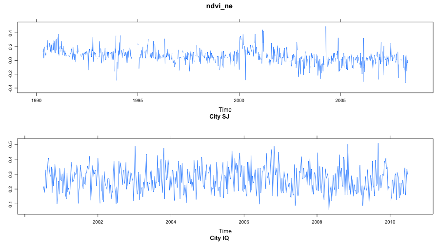
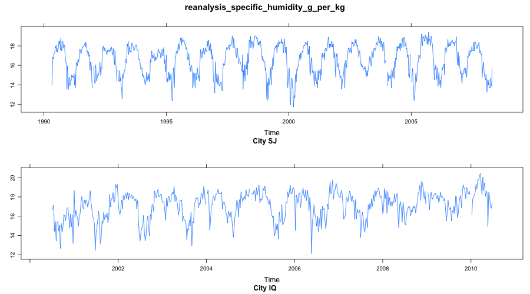
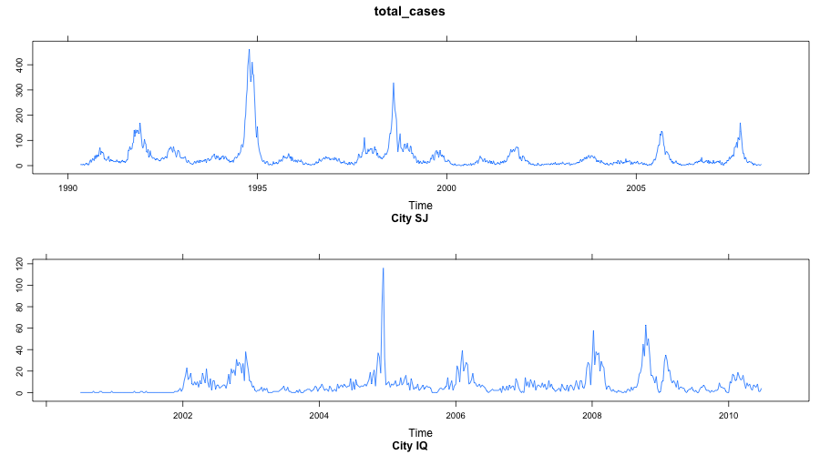

```{r load_packages, include = FALSE}
library("papaja")
library('tidyverse')
library('knitr')
library('kableExtra')
library('lubridate')
library('png')
library('grid')
options(knitr.table.format = "latex")
# load('../cache/not_loaded/item.categories.RData')
```

# Introduction

In this paper, I selected to approach the problem from a different angle that I usually do. In place of my usual approach of attempting to solve the problem using the training from this course and previous ones, I decided to investigate what published journal or white papers have done previously, especially trying to pick those papers which have reported higher scores in the competition. This approach allowed me to learn new techniques used by more experienced practitioners as well as extend my deep learning material I learnt in predict 453 few quarters ago.

This paper is organized as follows.

Secion I deliniates the overview of the methodologies used, the papers referenced and the challenges faced at a high level. It also explains some technical challenges faced.

Section II explains some of the exploratory work done.

Section III explains the data preparation activities.

Section IV outlines details of the Method Of Analogues model.

Section V outlines details of the deep learning models.

Section VI talks about the Bayesian Regression model.

Section VII wraps up the paper.

# Section I - Overview of Methodologies Used

I quickly read a plethora of published papers, white papers and class notes on this problem set. The difficulty of the problem revealed itself since almost everyone had used a different approach to solving the problem. Folks have attempted to solve this using everything from ensembled linear models to non-linear deep learning approaches to heuristic computational methods. I chose two papers to try and replicate. Both papers used methods not taught in the northwestern courses, but built upon techniques already taught in the courses so far. While I realized that trying to replicate a paper an entire paper created by a professor with his 3 PhD students within a span of a few weeks is not easily possible, I was determined to try. If nothing, I would learn new methods which I can apply at work.

The first paper [1] is an ensemble model of three sub-models: 10s of Method Of Analogue (MOA) models, 1000s of Additive Holt Winters models and naive models, with a novel median-voting based weight scheme. The MOA [3] is a method invented in 1969 for prediction of weather. It is widely used in meterological model building, and has been used for influenza prediction as well. Since there is no pre-written package in R for this method, it required me to chase down the mathematically nitty gritties [4] in a few papers and implement my own version of the model. There are many versions of MOA depending on the search algorithm, or the analogue selection algorithm. I studied a few of them, and decided to implement the simplest version. I could not implement the paper as is, with the main constraints being computational time required to solve these search based models iterative models on such a large forecast horizon.

The second paper I read relied on an ensemble of linear regression, weighted linear regression, and Bayesian regression models Out of these, I decided to learn a bit about the Bayesian model.

The third model I decided to investigate is a Recurrent Neural Network (RNN) model, specifically the Gated Recurrent Unit (GRU) and the Long Short Term Memory (LSTM). These models were ones I was looking into at the end of the Predict 490 (Deep Learning) course. This was my first foray into these recurrent models.

# Section II - EDA

1. Univariate studies

Time series plots were run for all the variables to get an idea of the underlying structure. While some signals don't show strong seasonal patterns like in figure 1. Others show very strong seasonality, like in figure 2. Depending on the chosen solution, this is useful information. The response variable `total_cases` shows the peaks and available information for the two cities. Note teh different time scales on the x-axis.

<!-- {width=70%} -->

```{r echo=FALSE, out.width = "60%", fig.pos = "!h"}
grid.raster(readPNG("../graphs/ndvi_ne.png"))
```
```{r echo=FALSE, out.width = "60%", fig.pos = "!h"}
grid.raster(readPNG("../graphs/reanalysis_specific_humidity_g_per_kg.png"))
```
```{r echo=FALSE,  out.width = "60%", fig.pos = "!h"}
grid.raster(readPNG("../graphs/total_cases.png"))
```
<!-- {width=70%} -->

<!-- {width=70%} -->

\newpage

1. Multivariate studies (Linear Correlations)

Linear correlation study between the Xs and Y for the two cities show remarkable difference between the cities, along with some key insights into the underlying structure of the data. Some key highlights:

* `total_cases` is very weakly correlated (if at all) with any of the Xs. Doesn't let itself to a simple way of predicting the values. It's weakly correlated with the `weekofyear` variable, which makes sense. When it's hotter, and wetter, there is a higher chance of dengue.

* SJ's corrplot shows us that almost all the correlations are positive, it at all. As expected, all the vegetation indices are correlated positively. As are all the temperature related variables. Further investigation using PCA showed me that for these variable groups, at max 2 PCs were needed to achieve ~97%+ of explanatory power for the variation in each group.

* IQ's corrplot has a few strong negative correlations, especially with the `tdtr` variable, which explains the daily temperature fluctuation. When it's very hot, or very humid, there is less temperature variable over the day. Given IQ's geographic location, perhaps this makes sense from a weather dynamics standpoint.

```{r echo=FALSE,  out.width = "60%", fig.pos = "!h"}
grid.raster(readPNG("../graphs/sj_corplot.png"))
```
```{r echo=FALSE,  out.width = "60%", fig.pos = "!h"}
grid.raster(readPNG("../graphs/iq_corplot.png"))
```

\newpage

# Section III - Data Preparation

The summary of the data preparation activities is:

- 

### Imputation


### Feature Engineering


\newpage

# Section IV - Method of Analogues

#### Method Details

#### Transfer Entropy

#### Computational Details

#### Internal Test Set

#### Drivendata.org Test Set


\newpage

# Section V - Deep Learning Models

### GRU or LSTM graph tree

### Hyperparameter tuning

### Performance Evaluation

#### Internal Test Set

#### Drivendata.org Test Set

# Section VI - Bayesian Regression Model

### Few notes

# Section VII - Wrap Up

1. The MOA model shows promise for one-step-ahead (or few-steps-ahead) forecasting, as long as there is enough history of the multivariate signals. Further investigation into methods of identification of analogues (PCA, Mahanobalis distance etc) might prove useful. Also, the search algorithm is expensive as implemented using for loops in R. Moving a lower level language like C++ might show execution speed improvements.

1. 

<!-- # Limitations -->

<!-- # Future work -->


\newpage

# R Packages Used


\newpage

# References

1. Buczak, A. L., Baugher, B., Moniz, L. J., Bagley, T., Babin, S. M., & Guven, E. (2018). Ensemble method for dengue prediction. PLoS ONE, 13(1), e0189988. http://doi.org/10.1371/journal.pone.0189988
1. Vicente, R., Wibral, M., Lindner, M., & Pipa, G. (2011). Transfer entropy—a model-free measure of effective connectivity for the neurosciences. Journal of Computational Neuroscience, 30(1), 45–67. http://doi.org/10.1007/s10827-010-0262-3
1. Viboud C, Boelle P-Y, Carrant F, Valleron A-J, Flahault A. Prediction of the spread of influenza epidemics by the Method of Analogues. American Journal of Epidemiology 2003; http://10.1093/aje/kwg239
1. Lorenz E. Atmospheric predictability as revealed by naturally occurring analogies. Journal of Atmospheric Science 1969; 26:636–646
1.https://github.com/amschwinn/dengue_prediction
1. https://cran.r-project.org/web/packages/TransferEntropy/TransferEntropy.pdf
1. https://ral.ucar.edu/sites/default/files/public/images/events/WISE_documentation_20170725_Final.pdf
1. https://tensorflow.rstudio.com/keras/
1. https://tensorflow.rstudio.com/blog/time-series-forecasting-with-recurrent-neural-networks.html

\begingroup
\setlength{\parindent}{-0.5in}
\setlength{\leftskip}{0.5in}

<div id = "refs"></div>
\endgroup